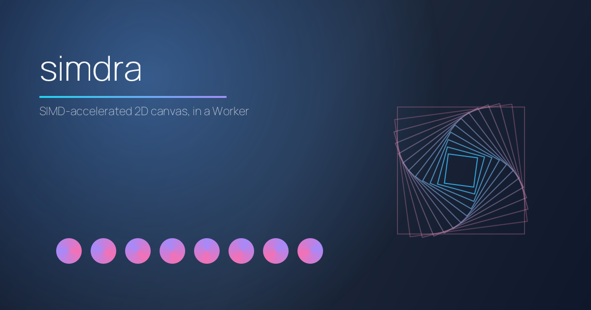

<p align="center">
  
</p>

# simdra

**SIMD-accelerated 2D canvas and image manipulation. In a Worker.**

Cloudflare Workers · browser Web Workers · Vercel Edge · Deno Deploy ·
any V8 isolate with WASM-SIMD.

```bash
npm install simdra
```

## Why

[`sharp`](https://sharp.pixelplumbing.com) is great. So is
[`@napi-rs/canvas`](https://github.com/Brooooooklyn/canvas). Neither
runs in a Cloudflare Worker, browser Web Worker, or any other V8
isolate that doesn't let you spawn threads. simdra fills that gap:
HTML5 Canvas 2D plus a sharp-shaped fluent surface, both compiled to
one ~500 KB gzipped WASM bundle with NEON / SSE / WASM-SIMD code
paths under the hood.

| Library | Cloudflare Workers? | Browser? | Native deps | Bundle |
|---|---|---|---|---|
| `sharp` | ❌ needs libvips | ❌ | yes (libvips) | — |
| `@napi-rs/canvas` | ❌ Node-API only | ❌ | yes (Skia) | — |
| `node-canvas` | ❌ Cairo native | ❌ | yes (Cairo) | — |
| `canvaskit-wasm` | ❌ too large | ✅ | no | ~7 MB |
| **`simdra`** | ✅ | ✅ | **no** | **~500 KB gz** |

CanvasKit is the closest comparable — both are WASM, both work in
the browser — but CanvasKit is a full Skia port (~7 MB) that's too
large for the Cloudflare Workers bundle limit and gives you the Skia
API rather than HTML5 Canvas. simdra targets the smaller, more
familiar Canvas surface plus the sharp shape, in 1/14 the size.

## What

Three surfaces, one SIMD-accelerated Zig core:

- **🎨 Canvas 2D** — drop-in HTML5 Canvas (`createCanvas`,
  `getContext('2d')`, `Path2D`, `ImageData`, `DOMMatrix`,
  `CanvasGradient`, `CanvasPattern`).
- **🖼 MicroSharp** — drop-in sharp-shaped fluent API
  (`microsharp(input).resize(...).toBuffer()`).
- **🦎 Zig core** — Skia-style `Sm*` primitives (`SmCanvas`,
  `SmPaint`, `SmPath`, `SmBitmap`). Embed in your own Zig project.

The three are independent at the consumer layer but call the same
Zig types underneath — same SIMD kernels, same encoders, same
decoders.

## Quick start

### Resize in a Cloudflare Worker

```js
import { microsharp } from 'simdra';

export default {
  async fetch(request) {
    const out = await microsharp(request.body)
      .resize(800, 600, { fit: 'cover', kernel: 'lanczos3' })
      .jpeg({ quality: 85 })
      .toBuffer();
    return new Response(out, {
      headers: { 'content-type': 'image/jpeg' },
    });
  },
};
```

### Canvas 2D in a Web Worker

```js
import { createCanvas } from 'simdra';

const canvas = createCanvas(400, 300);
const ctx = canvas.getContext('2d');

ctx.fillStyle = '#10b981';
ctx.fillRect(0, 0, 400, 300);
ctx.fillStyle = '#fff';
ctx.font = '24px sans-serif';
ctx.fillText('Hello, Worker', 20, 40);

const png = canvas.toBytes();
postMessage(png, [png.buffer]);
```

### Sharp-style chain in the browser

```js
import { microsharp } from 'simdra';

async function autoCrop(file) {
  const out = await microsharp(file)
    .rotate()                                 // autoOrient via EXIF
    .resize(1200, 800, { fit: 'cover', position: 'attention' })
    .modulate({ brightness: 1.1, saturation: 1.2 })
    .sharpen()
    .jpeg({ quality: 90 })
    .toBuffer();
  return new Blob([out], { type: 'image/jpeg' });
}
```

### Sharp's image-ops chain — single-thread, in WASM

simdra implements sharp's full image-operations API (~22 ops):

```js
const out = await microsharp(input)
  .rotate(90)                                 // 90° / 180° / 270° byte-exact
  .flip().flop()                              // mirrors
  .affine([1, 0.3, 0.1, 0.7])                 // affine transform
  .blur(2)                                    // separable Gaussian
  .sharpen({ sigma: 1, m1: 1, m2: 2 })        // libvips USM
  .median(3).dilate(1).erode(1)               // morphology
  .convolve({ width: 3, height: 3, kernel: [-1,0,1,-2,0,2,-1,0,1] })
  .gamma(2.2).negate({ alpha: false })        // tone curves
  .linear(1.2, -10).threshold(128)            // levels
  .normalise().clahe({ width: 16, height: 16 })
  .modulate({ brightness: 1.1, hue: 30 })
  .tint('#ff8800').greyscale()
  .png()
  .toBuffer();
```

See [`COMPATIBILITY.md`](./COMPATIBILITY.md) for sharp-API divergences.

## Two builds, one package

- `simdra` / `simdra/core` — Node, native via
  [node-zigar](https://github.com/chung-leong/node-zigar). NEON
  kernels on aarch64.
- `simdra/wasm` — browsers, Cloudflare Workers, Vercel Edge, Deno.
  WASM bundle, ~440 KB raw / ~175 KB gzip.

## When NOT to use simdra

- Multi-core image-processing servers — use `sharp`. simdra is
  single-thread by design; sharp wins on a 16-core box.
- GPU-bound workloads — use Skia / WebGPU.
- Wide-gamut, 16-bit, ICC-aware pipelines — use libvips.
- WebP / AVIF / JXL output — `stb_image_write` doesn't ship them;
  use `sharp`.

The bullseye is: *"I'm shipping image processing in a Cloudflare
Worker / Vercel Edge function / browser Web Worker / single-vCPU
lambda, and the Node-API libraries don't run there."*

## What you give up vs sharp / @napi-rs/canvas

- No multi-core throughput on a 16-core box.
- No WebP / AVIF / JXL output.
- No 16-bit / Lab / CMYK pipelines. RGBA8 sRGB only.
- No EXIF / ICC / XMP metadata round-trip (only `Orientation` is
  read for `autoOrient`).
- No tile-streaming for very-large-image inputs.

If any of those are dealbreakers, use sharp.

## Architecture

simdra is a two-layer library:

- **Zig** is a pure drawing library — Skia-style class taxonomy with
  the **`Sm` prefix** (analogous to Skia's `Sk*`): `SmSurface`,
  `SmCanvas`, `SmPaint`, `SmBitmap`, `SmPath`, `SmMatrix`,
  `SmGradient`. No HTML5 names anywhere in Zig. Folder structure
  mirrors Skia's `include/{core,effects,encode}/` and `src/{opts,utils}/`.
- **TypeScript** (`src/index.ts` + `src/microsharp/index.ts`) is the
  HTML5 / WebIDL compatibility layer plus the sharp-shaped fluent
  API. Both lower to the same vectorised raster pipeline.

Every hot loop is vectorised through Zig's `@Vector` primitives:
`@Vector(N, u8)` for byte ops, `@Vector(4, f32)` for per-pixel FMA
chains, `@select` for branchless masking, `@reduce(.Add, ...)` for
dot-products, `@splat` for kernel-weight broadcast. Same source
compiles to NEON on aarch64, SSE on x86, WASM-SIMD in browsers.

See the [Zig core docs](./docs/zig/index.md) for the full
architecture writeup.

## Documentation

- [Canvas 2D API](./docs/canvas/index.md) — drawing, paths,
  transforms, text, images, encoding.
- [MicroSharp API](./docs/microsharp/index.md) — pipeline,
  terminals, async patterns, comparison with sharp.
- [Zig core](./docs/zig/index.md) — Skia-shaped class taxonomy,
  Scan→Blitter pipeline, SIMD backends, file-is-struct module
  pattern.
- [Compatibility matrix](./COMPATIBILITY.md) — HTML5 + sharp spec
  coverage and divergences.
- [Roadmap](./Roadmap.md) — pixel format expansion (F16 / F32 /
  10:10:10:2 / single-channel), codec independence (replace stb
  with pure Zig).

## Marketing reference

Internal copy decks for landing-page / launch-post / CFP work:

- [`Marketing.md`](./Marketing.md) — cross-audience positioning,
  pitch ladder, framing notes.
- [`Marketing-js.md`](./Marketing-js.md) — JS / TS audience.
  Competitive matrix, code snippets, "in a Worker" framing.
- [`Marketing-zig.md`](./Marketing-zig.md) — Zig audience.
  `@Vector` patterns, file-is-struct, comptime backend dispatch.

## License

MIT.